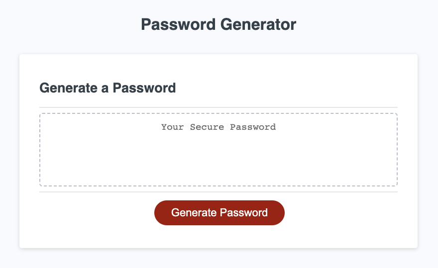

# password-generator

## Description

For this project, I was provided with HTML and CSS and challenged to complete the JavaScript portion to create a working password generator based on a specific criteria, as follows:

> WHEN I click the button to generate a password
> THEN I am presented with a series of prompts for password criteria
> WHEN prompted for password criteria
> THEN I select which criteria to include in the password
> WHEN prompted for the length of the password
> THEN I choose a length of at least 8 characters and no more than 128 characters
> WHEN asked for character types to include in the password
> THEN I confirm whether or not to include lowercase, uppercase, numeric, and/or special characters
> WHEN I answer each prompt
> THEN my input should be validated and at least one character type should be selected
> WHEN all prompts are answered
> THEN a password is generated that matches the selected criteria
> WHEN the password is generated
> THEN the password is either displayed in an alert or written to the page

This was my first time working intimately with JavaScript. It challenged me to spend a significant amount of time referencing MDN, W3Schools, Google, and utilize the knowledge of my peers and others to complete the task.

## Usage

To view the completed challenge, please go here: [password-generator]:(https://t4-k1.github.io/password-generator/)

## License

N/A
